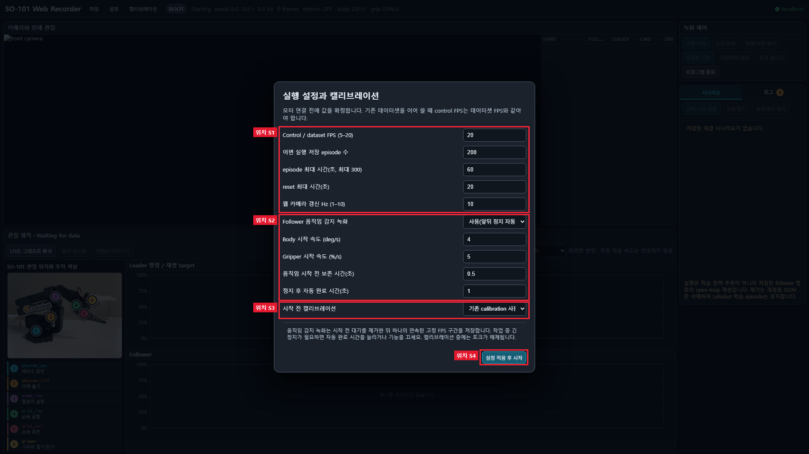
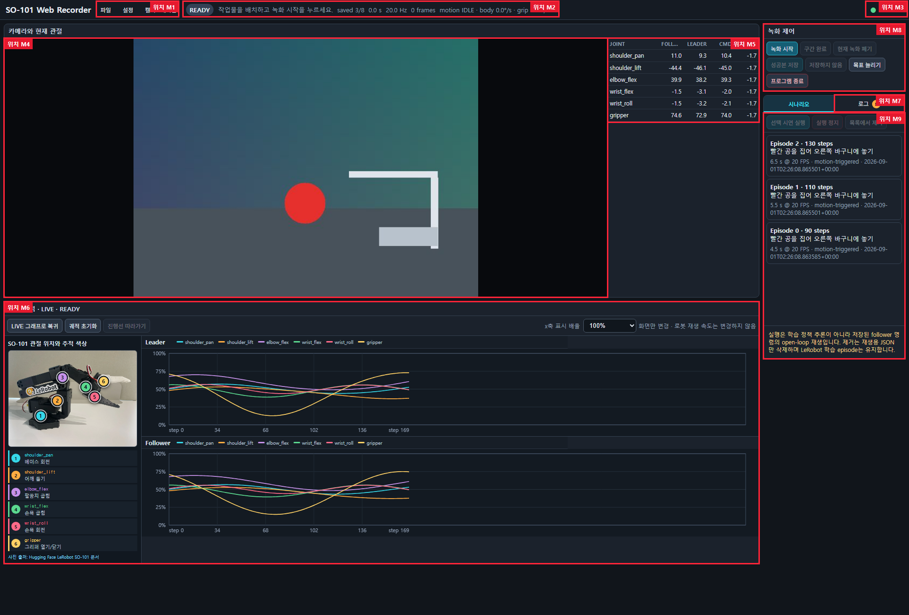

# SO-101 캘리브레이션 및 녹화 GUI

이 공개 브랜치는 SO-101 Leader/Follower를 LeRobot에 연결하고 시연 데이터를 수집하기 위한 최소 구성을 제공합니다.

포함 범위:

- Intel XPU, NVIDIA CUDA 또는 명시적인 CPU PyTorch 환경 확인
- SO-101 Leader/Follower 포트 확인
- Leader/Follower 개별 캘리브레이션
- Leader → Follower 수동 조작
- USB 카메라·관절값·Leader/Follower 궤적을 표시하는 localhost 웹 GUI
- LeRobot 시연 데이터 녹화와 저장 시나리오 재생·삭제

정책 학습, checkpoint Test, 실물 Policy Run, Agent/LM 기능은 포함하지 않습니다. GUI 오른쪽에는 `시나리오 | 로그` 탭만 있으며 Train·Agent 관련 프런트엔드, API와 Python backend도 이 브랜치에 두지 않습니다.

## 준비

프로젝트 가상환경을 활성화합니다.

```powershell
.\.venv\Scripts\Activate.ps1
```

LeRobot과 사용 중인 GPU에 맞는 PyTorch가 설치되어 있어야 합니다. 녹화 GUI는 LeRobot 설치에 포함되는 `numpy`, OpenCV(`cv2`), PySerial과 PyAV video backend도 사용합니다. 현재 Python과 LeRobot, PyTorch 및 GPU 연산을 확인하려면 다음 명령을 실행합니다.

```powershell
python .\hello_lerobot.py --device auto
```

`auto`는 CUDA를 먼저 확인하고, 없으면 XPU를 선택합니다. GPU가 없을 때 CPU로 자동 전환하지 않습니다. 장치를 직접 지정할 수도 있습니다.

```powershell
python .\hello_lerobot.py --device xpu
python .\hello_lerobot.py --device cuda
python .\hello_lerobot.py --device cpu
```

## 포트 확인

Leader와 Follower를 한 번에 하나씩 연결해 각 포트를 확인합니다.

```powershell
lerobot-find-port
```

이 프로젝트에서 확인했던 포트는 Follower `COM3`, Leader `COM5`였지만 USB 재연결 후 달라질 수 있습니다. 아래 명령의 포트는 현재 PC에서 확인된 값으로 바꾸십시오.

다른 LeRobot 프로세스, 시리얼 모니터 또는 IDE 확장 기능이 같은 포트를 점유하지 않도록 모두 종료합니다.

## Leader 캘리브레이션

```powershell
lerobot-calibrate `
    --teleop.type=so101_leader `
    --teleop.port=COM5 `
    --teleop.id=so101_leader_main
```

안내가 나오면 다음 순서로 진행합니다.

1. Leader를 관절 가동 범위의 중앙 자세로 옮긴 뒤 Enter를 누릅니다.
2. `wrist_roll`을 제외한 관절을 하나씩 전체 기계 범위로 천천히 움직입니다.
3. MIN/MAX 값이 실제 움직임에 따라 바뀌는지 확인합니다.
4. 모든 관절 범위를 기록한 뒤 Enter를 눌러 저장합니다.

## Follower 캘리브레이션

Follower 작업 공간을 비우고 팔을 손으로 받친 상태에서 실행합니다.

```powershell
lerobot-calibrate `
    --robot.type=so101_follower `
    --robot.port=COM3 `
    --robot.id=so101_follower_main
```

Leader와 같은 방식으로 중앙 자세와 전체 가동 범위를 기록합니다. 캘리브레이션 중에는 모터 전원이나 USB를 분리하지 마십시오.

## USB 장치 식별 설정

녹화 프로그램은 COM 번호가 USB 재연결 후 바뀌어도 같은 암을 찾도록 USB serial을 사용합니다. 다음 명령으로 현재 연결 정보를 확인합니다.

```powershell
python -c "from serial.tools import list_ports; [print(p.device, p.serial_number, p.description) for p in list_ports.comports()]"
```

출력된 값을 [run_teleoperate.py](run_teleoperate.py)의 다음 상수에 입력합니다.

```python
FOLLOWER_USB_SERIAL = "Follower USB serial"
LEADER_USB_SERIAL = "Leader USB serial"
```

카메라가 첫 번째 장치가 아니면 같은 파일의 `CAMERA_INDEX`도 현재 장치 번호로 변경합니다. IDE의 serial monitor, 다른 LeRobot 프로세스, Windows 카메라 앱과 화상회의 프로그램은 먼저 종료합니다.

## 수동 조작 확인

녹화 전에 Leader/Follower 추종과 카메라를 확인할 수 있습니다.

```powershell
python .\run_teleoperate.py
```

시작 자세 안전검사와 카메라 밝기 검사가 통과한 뒤에만 Follower 토크를 활성화합니다. 종료할 때 프로그램의 disconnect 메시지가 끝나기 전에 USB나 모터 전원을 분리하지 마십시오.

## 녹화 GUI 실행

```powershell
python .\run_record.py `
    --task "물체를 집어 목표 위치에 놓기" `
    --repo-id local/so101_dataset `
    --root .\datasets\so101_dataset
```

기본 브라우저에서 `http://127.0.0.1:8765`가 열립니다. 서버는 localhost에만 바인딩되며 명령 요청에는 실행마다 새로 만든 token을 사용합니다. 브라우저를 자동으로 열지 않으려면 `--no-browser`, 포트를 바꾸려면 `--dashboard-port`를 사용합니다.

기존 dataset root에 episode를 이어서 저장할 때는 같은 `--repo-id`, `--root`, `--task`와 함께 `--resume`을 추가합니다. `--resume` 없이 이미 존재하는 root를 지정하면 기존 데이터를 덮어쓰지 않고 실행을 거부합니다.

### 시작 설정과 캘리브레이션



- `위치 S1`: 제어·dataset FPS, 목표 episode 수, episode/reset 시간과 카메라 갱신률
- `위치 S2`: 움직임 감지 녹화, Body·Gripper 시작 속도, pre-roll과 정지 후 자동 완료 시간
- `위치 S3`: 기존 calibration 사용 또는 Leader/Follower 재캘리브레이션 선택
- `위치 S4`: 설정을 고정하고 포트·카메라·암 연결 시작

기본값은 20 Hz, 200 episodes, episode 최대 60초입니다. 기존 데이터셋을 이어서 기록할 때는 dataset FPS를 바꿀 수 없으며, 기존 episode가 있는 root에서는 재캘리브레이션을 허용하지 않습니다.

### 녹화 화면



| 위치 | 기능 |
| --- | --- |
| M1 | 파일 종료, 실행 설정 확인, 캘리브레이션 메뉴 |
| M2 | 현재 상태, 저장 수, 제어 Hz, frame 수와 움직임 감지 상태 |
| M3 | localhost 연결 상태 |
| M4 | Front USB 카메라 |
| M5 | Follower, Leader, 전송 명령과 추종 오차 |
| M6 | 같은 관절 색상을 공유하는 Leader/Follower 궤적과 x축 표시 배율 |
| M7 | 변화가 생겼을 때만 추가되는 이벤트 로그 |
| M8 | 녹화 시작·구간 완료·저장·폐기·목표 episode 증가·안전 종료 |
| M9 | 저장 시나리오 선택·재생·정지·목록 제거 |

`녹화 시작`은 LIVE 궤적을 초기화합니다. 움직임 감지 모드에서는 실제 움직임이 임계값을 연속으로 넘을 때 pre-roll부터 고정 FPS로 기록하고, Leader/Follower가 정렬된 정지 상태를 유지하면 REVIEW로 이동합니다. `성공 저장`을 눌러야 LeRobot episode와 재생용 scenario JSON이 확정됩니다.

시나리오의 `목록에서 제거`는 재생용 JSON만 삭제하며 LeRobot의 `data`, `videos`, `meta` episode는 삭제하지 않습니다. 궤적의 x축 배율도 화면 표시만 바꾸며 저장 timestamp나 실제 재생 속도는 변경하지 않습니다.

## 공개 GUI에 포함되지 않는 기능

다음 기능은 전체 프로젝트 저장소에만 있고 이 공개 브랜치에는 없습니다.

- Agent workflow, LM provider와 텍스트 결정 시험
- ACT 학습과 병렬 training worker
- checkpoint validation·오프라인 inference Test
- best checkpoint 실물 Policy Run
- 정책 학습·추론 runner, supervisor와 checkpoint 실행 backend

따라서 이 GUI에서 저장한 dataset을 학습하려면 별도의 전체 프로젝트 또는 표준 LeRobot 학습 환경을 사용해야 합니다.

## 자동 검사

하드웨어를 연결하지 않는 recorder 회귀 테스트를 실행합니다.

```powershell
python -m unittest -v test_recording_web_dashboard
```

테스트는 localhost API token, 카메라 JPEG worker, 20 Hz 제어 경로, 움직임 감지, 시나리오 저장·재생 안전성, 캘리브레이션/설정 계약과 공개 GUI의 두 탭 구성을 검사합니다. 실제 모터·카메라·GPU 검사는 포함하지 않습니다.

## 확인 기준과 문제 해결

- 각 암에서 모터 ID 1~6이 모두 검색되어야 합니다.
- 관절을 움직일 때 POS와 MIN/MAX가 함께 변해야 합니다.
- 측정 관절의 MIN/MAX 폭은 최소 100 tick 이상을 권장합니다.
- `There is no status packet`이 나오면 포트 중복 점유, 전원, USB 케이블, 모터 ID와 통신 상태를 먼저 확인합니다.
- `Could not connect on port`가 나오면 `lerobot-find-port`로 포트를 다시 확인합니다.
- 저장된 캘리브레이션과 모터 값이 다르다는 메시지가 나오면 해당 암만 다시 캘리브레이션합니다.

캘리브레이션이 완료된 뒤 수동 조작과 데이터 수집을 시작할 때는 동일한 LeRobot ID를 유지해야 합니다.
